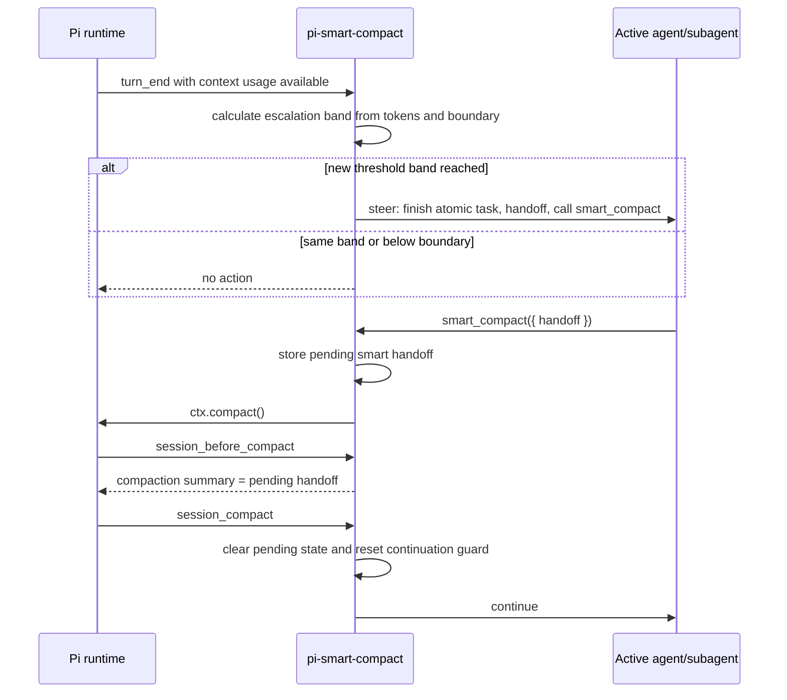

# feat: Add smart compaction extension

## Overview

Build `pi-smart-compact` as a public MIT Pi package that provides one TypeScript extension for cooperative, agent-authored compaction. The extension monitors context usage, sends visible steering prompts once the configured smart boundary is crossed, exposes a `/smart-boundary` command for global configuration, exposes a `smart_compact` tool for handoff submission, and uses Pi's compaction hooks to compact in the same session and automatically continue.

The plan prioritizes the core product decision from the PRD: warn and escalate, but do not force. Native Pi auto-compaction remains the safety net; this package adds an earlier cooperative boundary so main agents and subagents can preserve state at a coherent point.

---

## Problem Frame

Long-running Pi agents and subagents may continue through many tool calls and turns without stopping at a clean context boundary. Waiting for native auto-compaction can leave the agent operating with an unhealthy context window, while hard interruption risks corrupting partial work. The PRD defines a cooperative mechanism: nudge the agent early, let it finish the current atomic task, require it to write its own handoff, compact in the same session, and continue automatically (see origin: `docs/prd.md`).

---

## Requirements Trace

- R1. Monitor active context usage and detect when tokens cross a configurable smart boundary.
- R2. Default the smart boundary to 100,000 tokens.
- R3. Provide `/smart-boundary` to show, set, and reset a global user-level boundary setting, accepting values such as `100k` and `120000`.
- R4. Send visible user steering messages when the boundary is crossed, using 20,000-token escalation bands after the boundary.
- R5. Avoid same-band warning spam while still escalating as usage grows.
- R6. Instruct the agent to finish the current atomic task, save important artifacts, write a handoff, and call `smart_compact` when ready.
- R7. Provide a `smart_compact` tool that accepts the agent-authored handoff and treats the call as terminal for the current mini-phase.
- R8. Use the pending handoff as the compaction summary through Pi's compaction hook, while leaving ordinary/native compactions unchanged when no smart handoff is pending.
- R9. After smart compaction completes, clear pending state and automatically send a single `continue` message.
- R10. Preserve same-session behavior for main agents and subagents; do not create replacement sessions and do not force compaction from threshold monitoring alone.
- R11. Surface status notifications where UI support exists, without making UI availability a runtime requirement.
- R12. Provide automated tests for parsing, escalation, command behavior, tool behavior, compaction hook behavior, continuation de-duplication, and subagent safety.

---

## Scope Boundaries

- No new-session handoff flow; the extension must use same-session compaction.
- No hard cutoff or forced compaction from token monitoring alone.
- No disabling, replacing, or tuning Pi's native auto-compaction behavior.
- No custom LLM summarizer pipeline in the first version; the handoff supplied to `smart_compact` is the custom summary.
- No project-specific, per-agent, or per-subagent boundary overrides in the first version.
- No graphical configuration UI beyond `/smart-boundary` and optional notifications.
- No guarantee that an agent obeys steering before native compaction becomes necessary.

### Deferred to Follow-Up Work

- Project-local boundary settings: future iteration if users need repository-specific defaults.
- Rich dashboard or status panel: future UI work if basic notifications are insufficient.
- Published gallery preview metadata: follow-up release polish after the extension is implemented and manually verified.

---

## Context & Research

### Relevant Code and Patterns

- `README.md` already states the intended package shape and high-level behavior.
- `docs/prd.md` is the origin document and source of truth for behavior, non-goals, and testing expectations.
- Pi extension docs confirm custom tools via `pi.registerTool`, custom commands via `pi.registerCommand`, lifecycle hooks via `pi.on`, context usage via `ctx.getContextUsage()`, manual compaction via `ctx.compact()`, and user steering via `pi.sendUserMessage(..., { deliverAs: "steer" })`.
- Pi compaction docs confirm `session_before_compact` can return a custom compaction summary using Pi's prepared `firstKeptEntryId` and `tokensBefore`, and that ordinary compaction proceeds when the hook returns no override.
- Pi package docs confirm package discovery through `package.json` with `keywords: ["pi-package"]` and a `pi.extensions` manifest, with Pi core packages listed as peer dependencies when imported.
- Pi examples to mirror conceptually: trigger compaction after token threshold, customize compaction in `session_before_compact`, inject user messages with `deliverAs: "steer"`, register commands/tools, and use terminating tool results.

### Institutional Learnings

- No `docs/solutions/` learnings exist in this repository yet.
- After implementation, capture reusable decisions about Pi compaction hooks, steering semantics, or extension testing if they prove broadly useful.

### External References

- External web research was not used. Local Pi docs and installed examples are the authoritative implementation references for this Pi-specific package.

---

## Key Technical Decisions

- Implement as a TypeScript Pi package: this matches Pi's extension/package model and keeps installation compatible with `pi install` from git or npm.
- Keep the extension entrypoint thin: delegate parsing, escalation math, state transitions, and prompts to `src/` modules so behavior is unit-testable without a real Pi session.
- Use an extension-owned global config file for `/smart-boundary`: Pi package docs document global package settings but do not expose a stable extension configuration API, so the implementation should persist only this package's setting in a small user-level file rather than mutating Pi's package settings.
- Define the global config contract in `src/config.ts`: read from an extension-owned user config location, support a test-only path override, write atomically through a temporary file plus rename, treat missing config as default, and treat corrupt/unreadable config as default with a warning instead of crashing startup.
- Treat command parsing as a pure module: values like `100k`, `120000`, empty input, `reset`, invalid text, zero, and negatives should be deterministic and easy to test.
- Allow deliberately low positive boundaries for manual testing: the command may warn when values are below normal production expectations, but it must not reject them solely for being low.
- Track escalation by numeric band rather than raw token count: band `0` starts at the configured boundary, band `1` starts at boundary + 20k, and so on. This avoids spam while preserving escalation pressure.
- Use `pi.sendUserMessage` with `deliverAs: "steer"` for boundary warnings: visible steering is required so the agent receives the warning before the next LLM call instead of only after it becomes idle.
- Use `smart_compact` as a terminating tool result: this reduces the chance of an extra post-tool assistant response, while the tool prompt guidelines must also instruct agents to call it alone as the final action of a mini-phase because Pi only honors termination if every finalized tool result in the batch terminates.
- Store pending smart-compaction state separately from escalation state: the hook must only override compaction when a specific handoff is pending and must not affect manual or native compaction otherwise.
- Clear or expire pending state on every terminal compaction outcome: successful smart compaction clears after `session_compact`; compaction error/cancel marks the pending handoff failed so `session_before_compact` ignores it and later manual/native compactions cannot reuse stale content.
- Use a single continuation source: `session_compact` should be the normal place to send one `continue` message after a smart compaction, guarded by a pending id/flag to avoid duplicates.
- Avoid session replacement APIs entirely: using `newSession`, `fork`, or `switchSession` would violate subagent identity preservation.

---

## Open Questions

### Resolved During Planning

- Should the extension force compaction after repeated warnings? No. The PRD explicitly chooses escalation-only behavior, with native Pi compaction left as the safety net.
- Should the handoff be inferred from a generated handoff file? No. The agent must pass the handoff directly to `smart_compact` so the flow is explicit and testable.
- Should this create replacement sessions? No. Same-session compaction is required for subagent and parent-run compatibility.
- Is web research needed? No. The relevant APIs are Pi extension APIs available in the installed Pi docs and examples.

### Deferred to Implementation

- Exact TypeScript build/test tooling versions: choose current package versions during scaffolding and keep runtime Pi dependencies as peer dependencies.
- Exact notification wording and rendering details: keep messages concise and align them with what the Pi UI supports during implementation.
- Exact retry UX after compaction failure: the plan requires stale pending state to be ignored after failure; implementation may choose whether the user-facing message asks the agent to retry `smart_compact` with the same handoff.

---

## Output Structure

```text
pi-smart-compact/
├── docs/
│   ├── plans/
│   │   └── 2026-06-15-001-feat-smart-compaction-extension-plan.md
│   └── prd.md
├── extensions/
│   └── smart-compact.ts
├── src/
│   ├── config.ts
│   ├── constants.ts
│   ├── escalation.ts
│   ├── prompts.ts
│   ├── smart-compact-state.ts
│   └── smart-boundary-parser.ts
├── tests/
│   ├── command.test.ts
│   ├── compaction-hook.test.ts
│   ├── escalation.test.ts
│   ├── smart-boundary-parser.test.ts
│   ├── smart-compact-tool.test.ts
│   └── subagent-safety.test.ts
├── LICENSE
├── README.md
├── package.json
├── tsconfig.json
└── vitest.config.ts
```

---

## High-Level Technical Design

> *This illustrates the intended approach and is directional guidance for review, not implementation specification. The implementing agent should treat it as context, not code to reproduce.*



State model:

```text
below-boundary
  -> warned-band-N        when usage crosses boundary + N*20k
warned-band-N
  -> warned-band-N+1      when usage crosses next band
warned-band-N
  -> pending-smart-compact when agent calls smart_compact
pending-smart-compact
  -> compacted-continued  when session_compact confirms success
pending-smart-compact
  -> warned-band-N        if compaction errors and retry is appropriate
compacted-continued
  -> below-boundary or warned-band-current after next usage sample
```

---

## Implementation Units

- [ ] U1. **Scaffold package and test harness**

**Goal:** Establish the distributable TypeScript Pi package structure and a test harness for pure modules and mocked extension interactions.

**Requirements:** R12

**Dependencies:** None

**Files:**
- Create: `package.json`
- Create: `tsconfig.json`
- Create: `vitest.config.ts`
- Create: `extensions/smart-compact.ts`
- Create: `src/constants.ts`
- Create: `tests/fixtures/mock-pi.ts`
- Modify: `README.md`

**Approach:**
- Add package metadata for a public Pi package, including `pi-package` keywords, MIT license metadata, repository URL, and a `pi.extensions` manifest pointing at `extensions/`.
- Add peer dependencies for Pi-provided packages that the extension imports and dev dependencies for TypeScript/test tooling.
- Create a minimal extension entrypoint that can register behavior once later units add modules.
- Create a small mock Pi/extension context fixture that tests can reuse to assert registrations, sent messages, compaction calls, and notifications without invoking real LLMs or Pi sessions.

**Patterns to follow:**
- Pi package manifest conventions described by Pi package docs.
- Pi extension entrypoint convention: default export accepting the Pi extension API.

**Test scenarios:**
- Test expectation: none for runtime behavior in this unit; package/test harness completeness is verified by later unit tests importing the scaffolded modules and mock fixture.

**Verification:**
- The package metadata describes a Pi package with one extension entrypoint.
- TypeScript source and tests can import extension-facing types without bundling Pi core runtime packages.
- The README installation/status sections match the package shape.

---

- [ ] U2. **Implement smart-boundary parsing and global configuration**

**Goal:** Provide robust parsing and persistence for `/smart-boundary` so users can inspect, set, and reset the global boundary.

**Requirements:** R2, R3, R12

**Dependencies:** U1

**Files:**
- Create: `src/smart-boundary-parser.ts`
- Create: `src/config.ts`
- Modify: `src/constants.ts`
- Modify: `extensions/smart-compact.ts`
- Create: `tests/smart-boundary-parser.test.ts`
- Create: `tests/command.test.ts`

**Approach:**
- Represent the default boundary and escalation interval as named constants.
- Parse an empty command as "show current setting".
- Parse `reset` as "remove custom setting and return to default".
- Accept plain integer token counts and `k` shorthand values, normalizing to integer tokens.
- Reject invalid text, zero, negative values, and fractional forms that would be ambiguous.
- Accept low positive values for manual verification; if implementation wants to discourage accidental noisy settings, return a warning while still persisting the value.
- Persist only this extension's global boundary setting in an extension-owned user-level config file. Keep the persistence module narrow so the path strategy can be adjusted without touching command behavior.
- Implement config IO as missing-is-default, corrupt-is-default-with-warning, test-path-overridable, and atomic-write-by-replace.
- Register `/smart-boundary` in the extension entrypoint and route command handling through the parser/config modules.

**Execution note:** Implement parser behavior test-first; command handler tests can use the mock Pi context after parser behavior is pinned.

**Patterns to follow:**
- Pi command registration via `pi.registerCommand`.
- Existing README language for `/smart-boundary` behavior.

**Test scenarios:**
- Happy path: empty command reads default `100000` when no config exists and returns a clear current-boundary message.
- Happy path: `100k` stores and reports `100000`.
- Happy path: `120000` stores and reports `120000`.
- Happy path: `reset` removes custom config and reports the default boundary.
- Edge case: surrounding whitespace is ignored for valid values.
- Error path: invalid text such as `abc` is rejected and does not modify existing config.
- Happy path: a deliberately low positive value such as `100` is accepted for manual testing, with a warning if low-value warnings are implemented.
- Error path: `0`, negative numbers, and ambiguous fractional values are rejected and do not modify existing config.
- Error path: missing, corrupt, or unreadable config falls back to default and reports the condition without crashing.
- Integration: command registration exposes `/smart-boundary` with a description that matches README behavior.

**Verification:**
- Boundary values survive simulated extension reload by reading from persisted config.
- Invalid commands produce helpful messages and leave the prior setting intact.

---

- [ ] U3. **Implement token monitoring and escalation steering**

**Goal:** Detect token threshold crossings after turns and send progressively firmer steering messages without forcing compaction or spamming the same band.

**Requirements:** R1, R4, R5, R6, R10, R11, R12

**Dependencies:** U2

**Files:**
- Create: `src/escalation.ts`
- Create: `src/prompts.ts`
- Create: `src/smart-compact-state.ts`
- Modify: `extensions/smart-compact.ts`
- Create: `tests/escalation.test.ts`

**Approach:**
- Register a `session_start` handler that resets in-memory escalation state safely on startup/reload/resume unless durable custom-entry reconstruction is intentionally added later.
- Register a `turn_end` handler that reads `ctx.getContextUsage()` and exits quietly when usage is unavailable.
- Calculate escalation bands from the active boundary and 20,000-token interval.
- Send a steering user message only when the calculated band is higher than the highest band already sent for the current session state.
- Make prompt wording increasingly firm across bands while preserving the same instruction: finish the current atomic task, avoid starting major new work, save artifacts, write a handoff, and call `smart_compact` when ready.
- Use `pi.sendUserMessage` with `deliverAs: "steer"` so the message is delivered after the current assistant turn/tool calls and before the next LLM call.
- Guard UI notifications with `ctx.hasUI`; monitoring should work in non-interactive modes.
- Do not call `ctx.compact()` from monitoring alone.

**Technical design:** *(directional guidance, not implementation specification)*

```text
band(tokens, boundary):
  if tokens < boundary -> none
  else floor((tokens - boundary) / 20_000)

on turn_end:
  usage unavailable -> no-op
  band none -> optionally reset below-boundary state
  band <= highest_sent -> no-op
  band > highest_sent -> send steering, remember band
```

**Patterns to follow:**
- Pi trigger-compaction example for reading context usage after `turn_end`, but replace automatic compaction with steering.
- Pi send-user-message example for `deliverAs: "steer"` semantics.

**Test scenarios:**
- Happy path: usage below boundary sends no message.
- Happy path: first usage at or above boundary sends the first steering prompt.
- Happy path: usage crossing boundary + 20k sends the next escalation prompt.
- Edge case: repeated turns within the same band do not send duplicate prompts.
- Edge case: `ctx.getContextUsage()` returns undefined and monitoring does not throw.
- Edge case: a custom boundary from config changes band calculation.
- Edge case: after extension reload/session_start, escalation state is reset safely and does not depend on stale in-memory values from a prior runtime.
- Error path: `pi.sendUserMessage` failure is surfaced via notification/logging without crashing future monitoring.
- Integration: steering messages use `deliverAs: "steer"`, not `followUp` or hidden custom messages.
- Integration: no monitoring path calls `ctx.compact()`, `newSession`, `fork`, or `switchSession`.

**Verification:**
- Token monitoring escalates only at new bands and never forces compaction.
- Prompt wording clearly tells agents how and when to use `smart_compact`.

---

- [ ] U4. **Register smart_compact tool and pending handoff state**

**Goal:** Let the agent explicitly submit its own handoff and trigger same-session compaction as a terminal mini-phase action.

**Requirements:** R6, R7, R10, R11, R12

**Dependencies:** U1, U3

**Files:**
- Modify: `extensions/smart-compact.ts`
- Modify: `src/smart-compact-state.ts`
- Modify: `src/prompts.ts`
- Create: `tests/smart-compact-tool.test.ts`

**Approach:**
- Register `smart_compact` with a TypeBox parameter schema requiring a non-empty handoff string.
- Make the handoff guidance explicit: the handoff should cover progress/current task, decisions made, relevant files and artifacts, validation status, residual risks/blockers, and concrete next steps.
- Add `promptSnippet` and `promptGuidelines` that name `smart_compact` explicitly and tell the agent to call it only after finishing the current atomic task and saving important artifacts.
- On tool execution, validate the handoff, store pending state with enough metadata to identify a smart compaction in later hooks, notify the user if UI is available, and call `ctx.compact()`.
- Return a concise tool result saying compaction has started and no further action is needed until continuation.
- Return `terminate: true` so the agent is encouraged to stop after the tool call.
- Keep all state in the current extension runtime/session path; do not use session replacement APIs.

**Patterns to follow:**
- Pi custom tool registration patterns with TypeBox parameters.
- Pi terminating tool result example for `terminate: true`.
- Pi `ctx.compact()` example for start/completion/error notifications.

**Test scenarios:**
- Happy path: valid handoff stores pending smart-compaction state and calls `ctx.compact()` once.
- Happy path: tool result communicates that compaction started and includes `terminate: true`.
- Edge case: handoff with only whitespace is rejected and does not call `ctx.compact()`.
- Edge case: calling `smart_compact` while another smart compaction is pending does not overwrite state silently; it reports a safe outcome.
- Error path: `ctx.compact()` throws or invokes error callback, the extension reports failure, expires pending handoff state for hook purposes, and does not send `continue`.
- Integration: tool prompt guidelines tell the agent to call `smart_compact` alone as its final action for the mini-phase.
- Integration: handoff prompt guidance requires progress/current task, decisions, files/artifacts, validation, risks/blockers, and next steps.

**Verification:**
- The agent has one explicit tool for handoff submission.
- Tool execution initiates same-session compaction and never creates a replacement session.

---

- [ ] U5. **Customize compaction summary and continuation flow**

**Goal:** Use the agent's pending handoff as the compaction summary, preserve native compaction when no smart handoff exists, and send exactly one continuation after success.

**Requirements:** R8, R9, R10, R11, R12

**Dependencies:** U4

**Files:**
- Modify: `extensions/smart-compact.ts`
- Modify: `src/smart-compact-state.ts`
- Modify: `src/prompts.ts`
- Create: `tests/compaction-hook.test.ts`
- Create: `tests/subagent-safety.test.ts`

**Approach:**
- Register `session_before_compact` and check whether a pending smart handoff exists.
- If no pending handoff exists, return no override so manual/native compaction behavior remains unchanged.
- If a pending handoff exists, return a compaction object whose summary is the handoff plus a small provenance marker, while preserving Pi's prepared `firstKeptEntryId` and `tokensBefore`.
- Include metadata details identifying the summary as smart-compaction output for debugging.
- Register `session_compact` and, only for a matching smart compaction, clear pending handoff state, reset continuation guard, optionally reset escalation state, notify if UI exists, and send a single `continue` user message.
- Ensure compaction error/cancel paths expire the pending handoff so subsequent manual/native compactions do not use stale smart summary content.
- Ensure continuation delivery does not duplicate `ctx.compact({ onComplete })` behavior; if completion callbacks are used, they should notify only, not also continue.
- Preserve subagent identity by avoiding APIs that replace or fork sessions.

**Execution note:** Add compaction-hook tests before wiring continuation; stale handoff leakage is the highest-risk regression.

**Patterns to follow:**
- Pi custom compaction example returning `compaction.summary`, `firstKeptEntryId`, and `tokensBefore`.
- Pi compaction docs for leaving default behavior intact by returning no custom result.

**Test scenarios:**
- Happy path: pending handoff causes `session_before_compact` to return a custom summary containing the handoff.
- Happy path: custom summary preserves Pi's prepared `firstKeptEntryId` and `tokensBefore`.
- Happy path: `session_compact` after a smart compaction clears pending state and sends one `continue`.
- Edge case: `session_before_compact` without pending state returns no override.
- Edge case: manual/native compaction after a completed smart compaction does not reuse stale handoff content.
- Edge case: smart compaction failure/cancel followed by manual/native compaction does not reuse stale handoff content.
- Edge case: duplicate `session_compact` events for the same pending id do not send duplicate `continue` messages.
- Error path: compaction hook receives aborted signal or missing preparation data and falls back safely rather than corrupting state.
- Integration: tests assert that extension code does not call `newSession`, `fork`, or `switchSession`.

**Verification:**
- Smart compaction replaces the summary only for a pending `smart_compact` flow.
- The resumed agent receives exactly one continuation message and remains in the same session.

---

- [ ] U6. **Document installation, usage, and manual verification**

**Goal:** Make the package understandable and manually verifiable for early users before publishing.

**Requirements:** R2, R3, R4, R6, R7, R8, R9, R10, R11, R12

**Dependencies:** U2, U3, U4, U5

**Files:**
- Modify: `README.md`
- Create: `docs/manual-testing.md`
- Modify: `docs/prd.md` if implementation decisions reveal a necessary correction to the PRD status note

**Approach:**
- Document installation from GitHub/local path and expected package status.
- Document `/smart-boundary` usage with examples for show, set, and reset.
- Document the expected agent workflow after a warning, including handoff content guidance.
- Document how to manually test with a deliberately low boundary so maintainers do not need a real 100k-token session.
- Include a main-agent manual scenario and a subagent manual scenario that both verify warning → handoff → `smart_compact` → same-session compaction → single `continue`.
- Document the exact expected behavior when compaction fails or is cancelled: no stale handoff should affect later manual/native compaction, and the agent/user may retry explicitly.
- Document known limitations: no forced compaction, no project-specific settings, native compaction remains independent, and agent compliance is cooperative rather than guaranteed.

**Patterns to follow:**
- Existing README's concise explanation and PRD links.
- Pi package install examples conceptually, without turning the plan into a command script.

**Test scenarios:**
- Test expectation: none for docs-only changes. Manual verification scenarios are captured in `docs/manual-testing.md`.

**Verification:**
- A new user can understand what the extension does, how to configure it, and how to test the full warning-to-continuation flow locally.
- Documentation accurately reflects implemented behavior and known limitations.

---

## System-Wide Impact

- **Interaction graph:** `turn_end` monitors usage and may steer; `smart_compact` stores handoff and triggers compaction; `session_before_compact` optionally overrides summary; `session_compact` clears state and continues. These entry points must coordinate through shared pending state.
- **Error propagation:** Parser/command errors should return user-facing command messages. Monitoring errors should not break future turns. Tool/compaction errors should notify when possible and avoid sending continuation for failed compactions.
- **State lifecycle risks:** Highest sent escalation band, pending handoff, compaction id/guard, and continuation guard must be cleared or reset at the right lifecycle points to avoid warning spam, stale handoff reuse, and duplicate continuations.
- **API surface parity:** `/smart-boundary` is the human configuration interface; `smart_compact` is the agent handoff interface. Both must describe the same boundary/compaction behavior in README and prompt guidelines.
- **Integration coverage:** Unit tests should cover pure calculations; mocked extension tests should cover event/tool/command interactions; manual testing should verify real Pi steering, compaction, and continuation behavior with a low boundary.
- **Unchanged invariants:** Native Pi auto-compaction, manual `/compact`, session identity, subagent parent tracking, and model/provider behavior are not changed by this package.

---

## Risks & Dependencies

| Risk | Mitigation |
|------|------------|
| Global config persistence uses an unstable or platform-specific path | Keep config in a narrow module, use an extension-owned user-level file, and test reload behavior with mocked filesystem boundaries. |
| Same-band warning spam makes the extension annoying | Track highest sent band and test repeated same-band turns. |
| Agent ignores warnings and reaches native compaction anyway | Preserve Pi native auto-compaction as the safety net and document cooperative limits. |
| Stale handoff overrides a later manual/native compaction | Only override when pending smart state exists; clear state after success; test no-pending and post-clear paths. |
| Duplicate `continue` messages start multiple turns | Use one continuation source and an id/flag guard; test duplicate event delivery. |
| `terminate: true` does not stop after a multi-tool batch | Add explicit prompt guidelines telling agents to call `smart_compact` alone as the final action; document the limitation. |
| Subagent identity breaks if session replacement slips in | Do not use command-only session replacement APIs; include a subagent-safety test that scans/asserts no replacement calls. |
| Pi extension API changes | Use documented public APIs and keep Pi core packages as peer dependencies. |

---

## Documentation / Operational Notes

- README should stay clear that the extension is cooperative and does not force compaction.
- Manual testing should use a low temporary boundary to exercise the full flow quickly; `/smart-boundary` must allow this explicitly.
- Release notes should call out the public command `/smart-boundary` and tool `smart_compact` as the compatibility surface.
- If publishing to npm later, add package provenance/release workflow in a separate follow-up plan or issue.

---

## Sources & References

- **Origin document:** `docs/prd.md`
- **Project README:** `README.md`
- Pi extension documentation: extension lifecycle, commands, tools, steering messages, context usage, and compaction APIs.
- Pi package documentation: package manifest, conventional directories, and peer dependency guidance.
- Pi compaction documentation: `session_before_compact` custom summary behavior and default fallback behavior.
- Pi examples reviewed conceptually: trigger compaction, custom compaction, send user message, handoff, and terminating structured-output tools.
